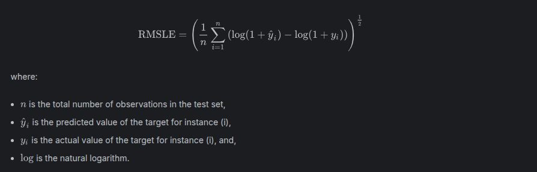

# Dataset Description
The dataset for this competition (both train and test) was generated from a deep learning model trained on the [Calories Burnt Prediction](https://www.kaggle.com/datasets/ruchikakumbhar/calories-burnt-prediction) dataset. Feature distributions are close to, but not exactly the same, as the original. Feel free to use the original dataset as part of this competition, both to explore differences as well as to see whether incorporating the original in training improves model performance.

***Your Goal***: Your goal is to predict how many calories were burned during a workout.

# Evaluation
The evaluation metric for this competition is Root Mean Squared Logarithmic Error.  
The RMSLE is calculated as:

## Files -
- **train.csv** - the training dataset; `Calories` is the continuous target
- **test.csv** - the test dataset; your objective is to predict the `Calories` for each row
- **sample_submission.csv** - a sample submission file in the correct format.